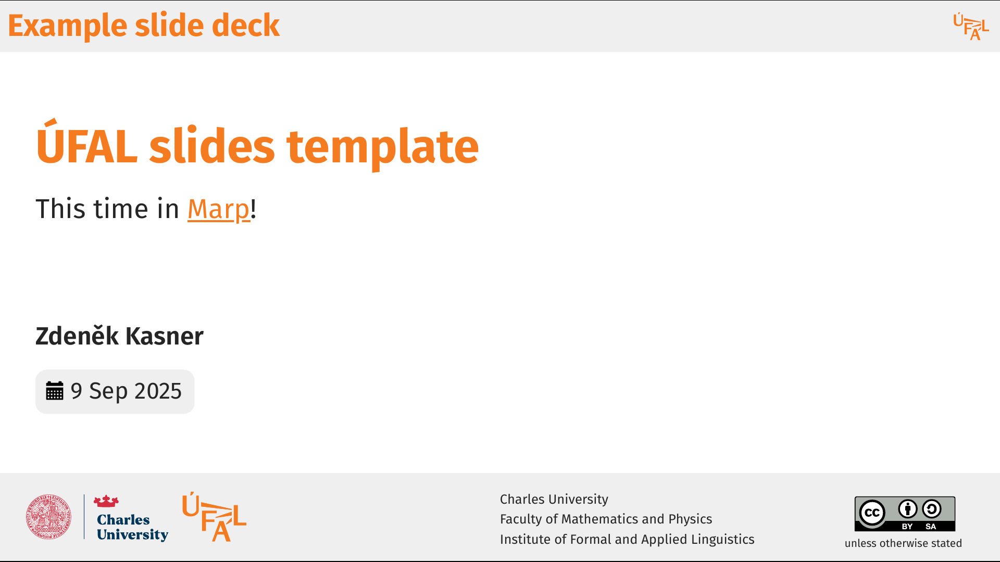
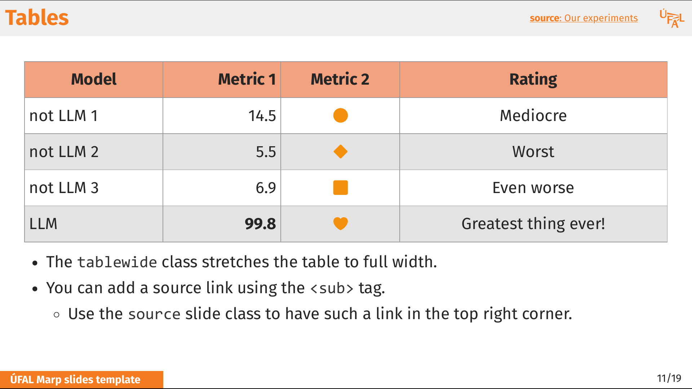

# ÚFAL Marp Template

A slide template for ÚFAL presentations with [Marp](https://marp.app/).

Inspired by the Jindřich Libovický's [ÚFAL Google Slides template](https://docs.google.com/presentation/d/1cE1fyaG9qWXJo5Upzi_i8mXMqUGbuYDgwqvHGYRgBSE/edit?usp=sharing) and Milan Straka's [SliMD template](https://github.com/ufal/slimd).

See also 👉️ **[ÚFAL Typst template](https://github.com/kasnerz/typst-slides-ufal)**.


<br>
<br>
<p>


</p>


## Main Features

* **Easy editing**: Create slides in your favourite Markdown editor with live preview.
* **Git-friendly**: You can version-control your presentations.
* **Multiple export formats:** Export to PDF, HTML, or PPTX.
* **LaTeX support**: Mathematical typesetting with MathJax/KaTeX.
* **HTML integration:** Use advanced HTML snippets alongside Markdown.
* **Consistency:** Everything is nicely aligned without too much effort.
* **Auto footer**: No more manual copying of the bottom orange bar 💪
* **Popular framework**:  Marp has good [user support](https://github.com/orgs/marp-team/discussions) and [docs](https://marpit.marp.app).


## Marp vs Typst ⚔️

Should I use the **Marp template** (this one) or the [Typst template](https://github.com/kasnerz/typst-slides-ufal)?

| Marp                                  | Typst                               |
| ------------------------------------- | ----------------------------------- |
| ✅ Simpler markup language             | ✅ Nicer markup language             |
| ✅ Interactive content (video, audio)  | ✅ More powerful layout handling     |
| ❌ Need to use HTML for advanced stuff | ✅ Online collaboration              |
|                                       | ❌ PDF-only - no interactive content |


## Quickstart


### Using VSCode

1. **Install the Marp extension**:
   - Install [Marp for VS Code](https://marketplace.visualstudio.com/items?itemName=marp-team.marp-vscode)

2. **Configure VS Code settings**:
   ```json
   {
     "markdown.marp.themes": ["path/to/ufal.css"],
     "markdown.marp.html": "all"
   }
   ```

3. **Create your slides**:
   - Copy `slides-template.md` as a starting point
   - Edit in VS Code with live preview
   - Export using the command palette: `Marp: Export Slide Deck`

### Using with Marp CLI

1. **Install Marp CLI**:
   ```bash
   npm install -g @marp-team/marp-cli
   ```

2. **Start development server**:
   ```bash
   marp --html --theme-set ufal.css -s slides-template.md
   ```

3. **Export presentations**:
   ```bash
   # Export to HTML
   marp --html --theme-set ufal.css slides-template.md -o presentation.html
   
   # Export to PDF
   marp --html --theme-set ufal.css slides-template.md -o presentation.pdf
   
   # Export to PowerPoint
   marp --html --theme-set ufal.css slides-template.md -o presentation.pptx
   ```

## Slide classes

- `title` - Title slide with ÚFAL branding
- `part` - Section divider slides
- `summary` - Final slide with boxed content
- `large`/`huge` - Bigger font sizes
- `center`/`middle` - Content alignment
- `col2`/`col3`/`col4` - Multi-column layouts
- `blank` - Clean layout without header/footer
- `no-logo` - Hide ÚFAL logo
- `tablewide` - Full-width tables
- `source` - Add source attribution

Combine classes: `<!-- _class: center middle huge -->`

## Quick reference

### Basic Slide Structure
```markdown
---
marp: true
theme: ufal
paginate: true
footer: Your presentation title
math: mathjax
---

# Your Title
Content goes here...

---

# Next Slide
More content...
```

### Images
```markdown
          # Width
          # Height
          # Background
```

### Math
```markdown
Inline: $E = mc^2$

Block:
$$
\sum_{i=1}^{n} x_i = \frac{n(n+1)}{2}
$$
```

## Contributing

Contributions are welcome! 🫵

## Resources

- [Marp Documentation](https://marpit.marp.app/)
- [Marp Community Themes](https://rnd195.github.io/marp-community-themes/)
- [Marp Discussion Forum](https://github.com/orgs/marp-team/discussions)
- [Original ÚFAL Google Slides Template](https://docs.google.com/presentation/d/1cE1fyaG9qWXJo5Upzi_i8mXMqUGbuYDgwqvHGYRgBSE/edit?usp=sharing)
