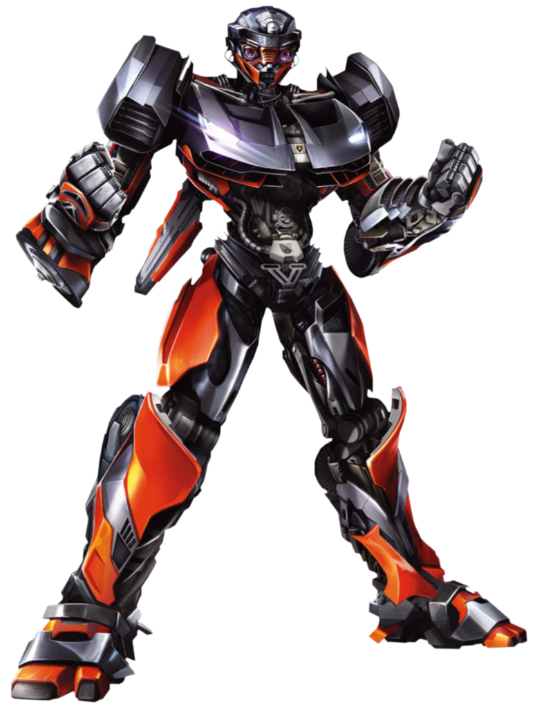

<!-- 
_class: title cc-by-sa

Title slide classes:
- cc-by-nc-sa / cc-by-sa (license badge)
- langtech (adds project logos)
Combine as needed: title langtech cc-by-sa
-->
# Example slide deck
## ÚFAL slides template
### This time in [Marp](https://marp.app)!
#### Zdeněk Kasner
##### 9 Sep 2025

<div style="position: absolute; bottom: 15px; left: 50%; width: 100%; text-align: left; font-size: 17px; z-index: 100">
Charles University<br>
Faculty of Mathematics and Physics<br>
Institute of Formal and Applied Linguistics
</div>

<div style="position: absolute; bottom: 12px; right: 48px; width: 100%; text-align: right; font-size: 14px; z-index: 100">
unless otherwise stated
</div>

---

<!-- _class: part -->
# What is this?

---

<!-- _class: col2 -->
# ÚFAL Marp Theme


### What is this?

- This slide deck is created in [**Marp**](https://marp.app), a Markdown-to-slides framework.

- It is styled with the `ufal.css` template:
  - Inspired by the ÚFAL [Google Slides template](https://docs.google.com/presentation/d/1cE1fyaG9qWXJo5Upzi_i8mXMqUGbuYDgwqvHGYRgBSE/edit?usp=sharing) and Milan Straka's [SliMD template](https://github.com/ufal/slimd).
  - You can also [contribute](https://github.com/kasnerz/marp-ufal)! 🫵

###

<div class="img-align">

</div>


---


<style scoped>
/* Hide bullets  */
ul { list-style: none; padding-left: 0; margin-left: 0; line-height: 1.8 }
ul > li { margin-left: 0; }
ul > li::marker { content: ""; }
</style>

# ÚFAL Marp Theme

### Main features
 <!-- 
    This image is included using HTML. Turn on `markdown.marp.html` in VSCode and use the `--html` flag for marp-cli for it to render correctly. 
 -->
 * 🔶 **Easy editing**: Create slides in your favourite Markdown editor.
 *  **Git versioning**: Slides are simple plain text files (+assets).
*  🪧 **LaTeX support**: Proper support of $\LaTeX$ typesetting.
*  ✒️ **Consistent style:** Everything is nicely aligned without extra effort.
*  ⚡️ **Powerful content:** You can use full-fledged HTML if needed.
* 🦶 **Auto-footer**: No more manual copying of the bottom orange bar 💪
* 📃 **Popular framework**:  Marp has good [user support](https://github.com/orgs/marp-team/discussions) and [docs](https://marpit.marp.app).


<br>

---

<!-- _class: part -->
# How to use it?

---


# Markdown 101


You can use the Markdown syntax for creating slides.
### `###` This is an H3 header.
- This is a bulleted list.
  - With a nested item.
1. And this is a numbered list.

You can also use \*\***bold text**\*\*, \**italic text*\*,  \[[links](https://ufal.cz)\]\(https://ufal.cz), `monospace`, etc.

The `---` sequence works as the slide delimiter.

<hr>

<small>You can also [enable HTML](https://github.com/orgs/marp-team/discussions/349#discussioncomment-3618297) for some advanced tweaks.</small>

---

# Slide layouts

Slide layout can be modified using class directives `<!-- _class: classname -->`:

- **`large`** - Bigger font
- **`huge`** - Even bigger font 
- **`center`** - Center-aligned content
- **`middle`** - Vertically centered
- **`blank`** - No header/footer, clean layout
- **`part`** - Section divider
- **`summary`** - Final slide with boxed content
- **`no-logo`** - No ÚFAL logo in the corner

Combine classes: `<!-- _class: center middle huge -->`

---

<!-- _class: center -->
<sub>[**source**: Our experiments](https://github.com/ufal)</sub>

# Working with images
## Image placement and sizing

Use [Marp image syntax](https://marpit.marp.app/image-syntax) to include an image:
```markdown

```


Or [enable HTML](https://github.com/orgs/marp-team/discussions/349#discussioncomment-3618297) to use `` elements:

```html

```

##### This slide uses the `center` class.

---

<!-- _class: center middle huge blank -->

## LaTeX typesetting

You can render both inline $\LaTeX$ and separate equations:
$$
\mathcal{L}(\theta) = \sum_{i=1}^{n} \log p(y_i | x_i, \theta) - \lambda \|\theta\|_2^2
$$

##### This slide uses classes `center`, `middle`, `huge`, and `blank`.

---
<!-- _class: col2  -->

# Code blocks & columns

<style scoped> pre { font-size: 25px !important; } </style>

### Python code

Syntax highlighting is supported:

```python
def factorial(n):
    if n == 0:
        return 1
    else:
        return n * factorial(n - 1)
```

#####

Use class `col{2,3,4}` for multiple columns.

### Javascript code
We use `<style scoped>` for making code font size larger on this slide.

```javascript
function greet(name) {
    console.log(`Hello, ${name}!`);
}
```

<!-- For more fine-grained manipulation with columns, use  -->


---

# Tables
<!-- _class: tablewide source -->

| Model         | BLEU ↑   | ROUGE-L ↑ | Parameters | Training Time |
| ------------- | -------- | --------- | ---------- | ------------- |
| Transformer   | 34.2     | 56.8      | 110M       | 12h           |
| GPT-3.5       | 38.7     | 61.2      | 175B       | -             |
| **Our Model** | **41.3** | **64.1**  | 125M       | 8h            |

<sub>[**source**: Our experiments](https://github.com/ufal)</sub>

- The `tablewide` class stretches the table to full width.
- You can add the source link (or any other text) to the top right <br>using the `<!-- _header: text -->` directive.


---
<!-- _class: middle -->
<style scoped>
    ul, ol {
        line-height: 1.8;
    }
</style>

# Fragmented lists

### How to animate lists
* This is an **animated bulleted list** 💣️
* How is that possible?
* Because we use `'*'` instead of `'-'` for the bullets! 💡

1) Similarly, this numbered list using `'X)'` instead of `'X.'` is animated.
2) Of course this works only in HTML, not PDFs.
3) You can still copy the slides for PDF animations.

<!-- 
You can also animate anything using:

<div data-marpit-fragment>

text

</div> 
-->

---


<!-- _class: part -->
# Practical tips


---

<!-- When we use `bg` on the slide, it is currently not possible to use the `h1` header. Instead, we can use the `_header` directive. -->

<!-- _header: Development -->

## VSCode plugin
Install the [Marp VSCode plugin](https://marketplace.visualstudio.com/items?itemName=marp-team.marp-vscode) to get **live preview**.


Also see the following settings:
- `markdown.marp.themes`: Add the path to `ufal.css`.
- `markdown.marp.html`: Set to `all` <small>(if you trust your code)</small>.
  


---

# Development

## `marp-cli` live server

```bash
$ marp --html -s .
[  INFO ] [Server mode] Start server listened at http://localhost:8080/ ...
```


---

<!-- _class: col2 center middle -->
# Export to PDF, HTML and PPTX

## VSCode


## `marp-cli`

```bash
$ marp slide-deck.md -o output.html
$ marp slide-deck.md -o converted.pdf
$ marp slide-deck.md -o converted.pptx
```

---

# Links

- [How to code beautiful presentations with Marp](https://xicu.info/en/posts/marp/)
- [Community themes](https://rnd195.github.io/marp-community-themes/)
- [Arivu Theme](https://github.com/gsm-arivu/gsm-arivu.github.io)
- [Live slides preview for development](https://github.com/boborbt/marp-dev-preview)
- [Marpyter - Marp for JupyterLab](https://github.com/trungleduc/marpyter)
- [Obsidian plugin](https://github.com/samuele-cozzi/obsidian-marp-slides)
- [Discussion forum](https://github.com/orgs/marp-team/discussions)


---

<!-- _class: summary center -->

#### Thank you for using the template!
## Takeaways

Marp is easy to learn and easy to use.
Give **Marp** a chance! 😎

### https://github.com/kasnerz/marp-ufal

---

# Bonus

## Panels

<div class="panel">

* panel 1 
  - content<br>more<br>content<br>and even more content
* panel 2
  - some other content
* panel 3
  - yet another content
</div>

